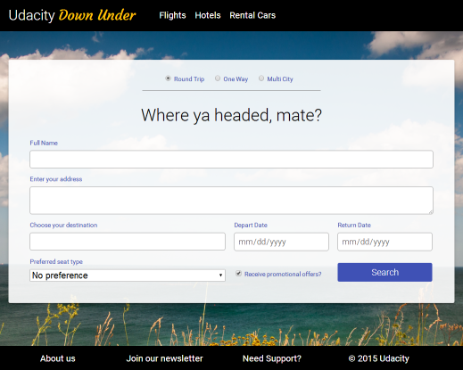

Let's try some of the focus techniques we just discussed. Again, using Chrome, go to this <a href="http://robdodson.github.io/udacity-a11y/lesson2-focus/01-basic-form/" target="_blank">airline site mockup page</a> and search for a specific ticket **using only keyboard input**. The page doesn't accept mouse input, so you can't fudge the exercise (not that we don't trust you ;-). 

The ticket parameters you should specify are:

 - one way
 - to Melbourne
 - leaving on 12 October 2017 (10/12/2017)
 - returning on 23 October 2017 (10/23/2017)
 - window seat
 - do not want to receive promotional offers

When you successfully complete the form with no input errors and activate the Search button, the form will simply clear and reset. Go ahead and complete the form, then come back.

Let's examine how the form uses your keyboard input. Starting with your first few `Tab` presses, the browser highlights the navigation items for Flights, Hotels, and Rental Cars. As you continue to press `Tab` you proceed to the radiobutton group where you can choose from Round Trip, One Way, or Multi City using the arrow keys. 

Continue through the name and address fields, filling in the required information. When you arrive at the destination select element, you can use the arrow keys to choose a city, or you can start typing to autocomplete the field. Similarly, in the date fields, you can use the arrow keys or just type a date. 

Selecting a seat type also relies on the arrow keys, or you can type "w", "a", or "n" to jump to a seat option. Then you can disable the promotional offers default by pressing the spacebar while the checkbox is focused. Finally, focus the Search button and press `Enter` to submit the form.

It's very handy to interact with a form using just the keyboard and to not have to switch to the mouse and back to complete a task. Because all of the elements used in the form are native HTML tags with implicit focus, the form works fine with the keyboard, and you don't have to write any code to add or manage focus behavior.
