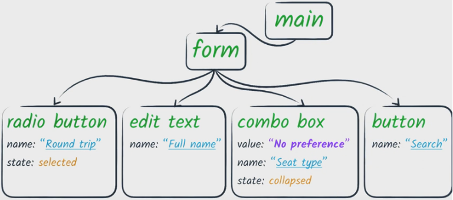
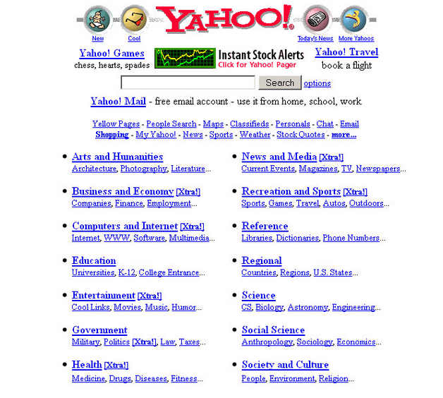

Imagine you're building a user interface for screen reader users *only*. Here, you don't need to create any visual UI at all, but just provide enough information for the screen reader to use. 

What you'd be creating is a kind of API describing the page structure, similar to the DOM API, but you can get away with less information and fewer nodes, because a lot of that information is only useful for visual presentation. It might look something like this. 

This is basically what the browser actually presents to the screen reader. The browser takes the DOM tree and modifies it into a form that is useful to assistive technology. We refer to this modified tree as the *Accessibility Tree*.

You might visualize the accessibility tree as looking a bit like an old web page from the '90s: a few images, lots of links, perhaps a field and a button. 

Visually scanning down a page like this case gives you an experience similar to what a screen reader user would get. The interface is there, but it is simple and direct, much like an accessibility tree interface.

The accessibility tree is what most assistive technologies interact with. The flow goes something like this.

 1. An application (the browser or other app) exposes a semantic version of its UI to assistive technology via an API.
 1. The assistive technology may use the information it reads via the API to create an alternative user interface presentation for the user. For example, a screen reader creates an interface in which the user hears a spoken representation of the app.
 1. The assistive technology may also allow the user to interact with the app in a different way. For example, most screen readers provide hooks to allow a user to easily simulate a mouse click or finger tap.
 1. The assistive technology relays the user intent (such as "click") back to the app via the accessibility API. The app then has the responsibility to interpret the action appropriately in the context of the original UI.

For web browsers, there's an extra step in each direction, because the browser is in fact a platform for web apps that run inside it. So the browser needs to translate the web app into an accessibility tree, and must make sure that the appropriate events get fired in JavaScript based on the user actions that come in from the assistive technology.

But that is all the browser's responsibility. Our job as web developers is just to be aware that this is going on, and to develop web pages that take advantage of this process to create an accessible experience for our users.

We do this by ensuring that we express the semantics of our pages correctly: making sure that the important elements in the page have the correct accessible roles, states, and properties, and that we specify accessible names and descriptions. The browser can then let the assistive technology access that information to create a customized experience.
