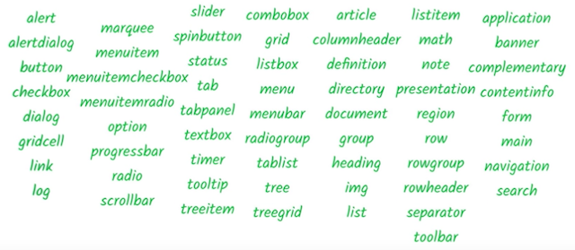

As you saw with the checkbox example, ARIA can modify existing element semantics or add semantics to elements where no native semantics exist. It can also express semantic patterns that don't exist at all in HTML, like a menu or a tab panel. Often, ARIA lets us create widget-type elements that wouldn't be possible with plain HTML.

 - For example, ARIA can add extra label and description text that is only exposed to assistive technology APIs.


<button aria-label="screen reader only label"></button>


 - ARIA can express semantic relationships between elements that extend the standard parent/child connection, such as a custom scrollbar that controls a specific region.



. . .



 - And ARIA can make parts of the page "live", so they immediately inform assistive technology when they change.



GOOG: $400



Let's take a closer look at what ARIA roles and attributes are available and how to use them.

One of the core aspects of the ARIA system is its collection of *roles*. A role in accessibility terms amounts to a shorthand indicator for a particular UI pattern. ARIA provides a vocabulary of patterns we can use via the `role` attribute on any HTML element.

When we applied `role="checkbox"` in the previous example, we were telling assistive technology that the element should follow the "checkbox" pattern. That is, we're guaranteeing that it will have a checked state (either checked or not checked), and that the state may be toggled using the mouse or the spacebar, just like a standard HTML checkbox element.

In fact, because keyboard interactions feature so prominently in screen reader usage, it's very important to make sure that, when creating a custom widget, the `role` attribute is always applied in the same place as the `tabindex` attribute; this ensures that keyboard events go to the right place and that when focus lands on an element its role is conveyed accurately.

The <a href="https://www.w3.org/TR/wai-aria/" target="_blank">ARIA spec</a> describes a taxonomy of possible values for the `role` attribute and associated ARIA attributes that may be used in conjunction with those roles. This is the best source of definitive information about how the ARIA roles and attributes work together and how they can be used in a way that is supported by browsers and assistive technologies.

However, the spec is very dense; a more approachable place to start is the <a href="http://rawgit.com/w3c/aria/master/practices/aria-practices.html" target="_blank">ARIA practices document</a>, which explores best practices for using the available ARIA roles and properties.

ARIA also offers landmark roles that extend the options available in HTML5. See the <a href="http://rawgit.com/w3c/aria/master/practices/aria-practices.html#kbd_layout_landmark_XHTML" target="_blank">Landmark Roles Design Patterns</a> spec for more information.
